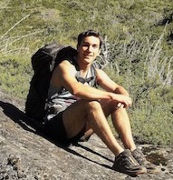

## María Rebolleda Gómez 

I am an evolutionary ecologist fascinated with bacteria, fungi, and plants. I did my undergraduate degree in Biology at UNAM (the National University in Mexico) and my PhD at the University of Minnesota with Michael Travisano. 

I am interested in how evolutionary processes evolve, the roles of history and chance in ecology and evolution, and microbial eco-evolutionary dynamics: how ecological interactions affect evolutionary pathways and how evolution transforms ecological processes. But I am also very interested (not in order of importance) in politics, the complex interactions between science and society, geography and architecture. I like to see the world with different lenses and I have found that learning and interacting with people from other disciplines keeps me creative and engaged. In particular I am fascinated by the importance of space in shaping interactions and everyday dynamics from social housing, community spaces, urban planning to the evolution of microbial interactions. My engagements and interdisciplinary collaborations vary: workshops, outreach, community involvement, teaching and mentorship as well as different research initiatives.

I tend to be pluralist about ways of thinking and forms of looking at the world. Therefore, I really value and appreciate difference and have a strong commitment to increasing representation of minorities in science, including questioning and changing the ways our disciplines are exclusionary and built on histories of oppression.

## Ariel Favier

I am a second year PhD student in Ecology and Evolutionary Biology at UCI. I graduated from Universidad Nacional del Comahue, in Argentine Patagonia. I am interested in how eco-evolutionary factors interact at different spatio-temporal scales. More specifically, I seek to elucidate the adaptive role of epigenetics in communities of sessile organisms under climate change scenarios. Additionally, I see outreach and teaching as tools to make science a truly collective activity. In the COMMONS lab I will study how the composition of microbial communities is affected by global warming, and evaluate its potential consequences on biogeochemical cycles.
When outside the lab, I might be reading, hiking in the mountains, playing tennis or carving wood.

## Liz Ortiz De Ora Ortiz

I am originally from Mexico and earned my PhD in molecular microbiology from Tel Aviv University. I am passionate about the molecular mechanisms by which bacteria thrive in their environments. My research focuses on understanding inter-kingdom signaling mechanisms that govern host-microbe interactions and evolution.

## Daniela Reyes

I’m a microbiologist trying to understand ecological interactions between microbes and their environment. I have an undergrad degree in microbiology from the Autonomous University of Queretaro (UAQ) and a Ph.D in science from the National Autonomous University of Mexico (UNAM), where I worked identifying and describing microbial interactions using a synthetic experimental system and mathematical models in the [Fuentes-Hernández lab](http://www.fuentes-hernandez.com/) at the Center of Genomic Sciences.

Currently, I’m interested in understanding the ecological role of antimicrobial molecules in natural microbial communities and the importance of metabolic changes in the structure and functionality of communities.

I’m also interest in gender and ethics studies applied to science, the interactions between science and art and science communication.
In my free time I enjoy knitting, reading and photography.
Web: https://danielareyesglez.com
Google Scholar: [Daniela Reyes-González] (https://scholar.google.es/citations?user=fwnfLJgAAAAJ&hl=es)
Twitter: @DanielaReyesGlez

%## Alejandra Hernández

# Lab alumni
## Anaïs Trinephi

Recent graduate from UCI (Bachelor's degree in Biological Sciences), now going to Columbia University to do a masters in biotechnology.  I enjoy gaining hands-on laboratory experience and have career goals of working as a scientist in the biotechnological field.  I want to contribute to scientific progress by working on projects that respond to issues that are prevalent in today's world.  As a member of the COMMONS lab, I was studying the composition and assembly of microbial communities as well as their capacity to produce CO2 as lignin decomposers to explore their potential uses in biofuel production in the context of climate change. Other than furthering my interest in biological sciences, I love expressing my creativity through drawing or painting.

## Jonathan Villafana

Recent graduate from UCI (Neurobiology major at UCI). I am a first-generation student. I am interested in exploring the intersection of microbial ecology, medicine, and research to discover novel solutions to age-old problems. More specifically: how microbial organisms can be used to address the issues of antibiotic resistance and climate change. In the COMMONS lab, I was studying the role of fungal and bacterial community assembly on specific biochemical processes. Outside of the lab, I enjoy singing, having existential crises about space, and traveling. 

## Emiliana Zapata 
Emiliana Zapata is the lab pet. She is interested volatiles produced through microbe-animal interactions. She is named after Emiliano Zapata, a leader of the Mexican Revolution. 

## You?

If you are a graduate student interested in joinning the COMMONS lab, read our website and reach out! Write Maria an email (mreboll1@uci.edu) with some information about you and why are you interested in joinning.

If you are an undergraduate student interested in doing reserach in our lab as part of BIO199, please reach out! Write Maria an email (mreboll1@uci.edu) with some information about you and why are you interested in joinning our lab.

**We currently do not have funding for new postdocs**

