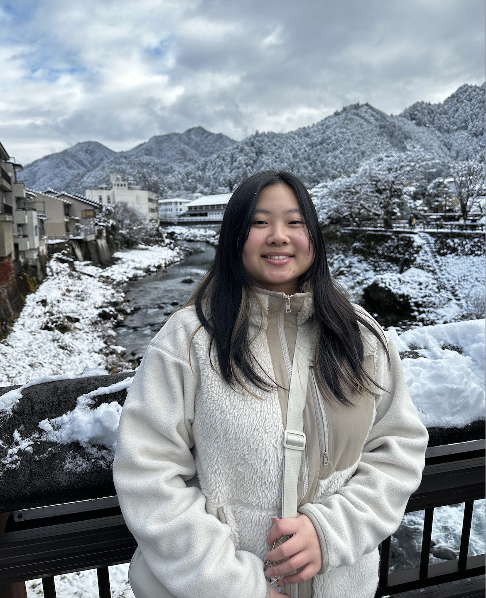

## María Rebolleda Gómez 

I am an evolutionary ecologist fascinated with bacteria, fungi, and plants. I did my undergraduate degree in Biology at UNAM (the National University in Mexico) and my PhD at the University of Minnesota with Michael Travisano. 

I am interested in how evolutionary processes evolve, the roles of history and chance in ecology and evolution, and microbial eco-evolutionary dynamics: how ecological interactions affect evolutionary pathways and how evolution transforms ecological processes. But I am also very interested (not in order of importance) in politics, the complex interactions between science and society, geography and architecture. I like to see the world with different lenses and I have found that learning and interacting with people from other disciplines keeps me creative and engaged. In particular I am fascinated by the importance of space in shaping interactions and everyday dynamics from social housing, community spaces, urban planning to the evolution of microbial interactions. My engagements and interdisciplinary collaborations vary: workshops, outreach, community involvement, teaching and mentorship as well as different research initiatives.

I tend to be pluralist about ways of thinking and forms of looking at the world. Therefore, I really value and appreciate difference and have a strong commitment to increasing representation of minorities in science, including questioning and changing the ways our disciplines are exclusionary and built on histories of oppression.

## Alejandra Hernández Terán

I am a plant and microbial ecologist, deeply passionate about understanding plant-microbiome interactions and their impacts on plant fitness. My long-term goal is to apply this knowledge to improve agricultural practices. I earned my undergraduate degree in Biology from the Universidad Autónoma Metropolitana in Mexico City. I then pursued a PhD in Sciences at the Instituto de Ecología of the Universidad Nacional Autónoma de México (UNAM), under the guidance of Dr. Ana E. Escalante. My doctoral research explored how plant genetic diversity influences phenotypic traits and ecological interactions in wild cotton populations. Currently, in the COMMONS Lab, my research centers on investigating the effects of the microbiome on plant development, using Arabidopsis thaliana as a model. I am also studying how plant domestication influences the assembly and diversity of the root microbiome across various crops. Also, I have a strong interest in bioinformatics and data visualization. Outside of my scientific work, I enjoy botanical drawing, bouldering, and cycling.

## Bryan Lynn

Bryan takes both a theoretical and empirical approach to understanding the effect of microbial interactions, ecology, and evolution. His first passion was math. Earning his BS in mathematics from the University of Massachusetts – Boston he later found himself enamored with applying mathematical theory to microbial ecology. He went on to earn a PhD in Integrative Biology from Oregon State University with advisors Patrick De Leenheer and Martin Schuster by combining both theoretical and lab experimentation to understand how cooperation (or the lack thereof) via the production of a public good enzyme influences microbial population dynamics. His current project as a Postdoctoral researcher investigates how spatial structure influences a microbial community’s functions and stability. Generally, Bryan is interested in the intersections of ecology, evolution, and social science. Outside of academia you can usually find Bryan obsessing over his cat, Pancake, trying to find the best doughnuts in town, or starting a new craft to abandon halfway through finishing.

## Ariel Favier

I am a PhD Candidate from Andean Patagonia. Having lived most of my life in a place of extremes, I developed a curiosity for the adaptability of all natural things. My work at the COMMONS Lab looks at how bacterial physiology has historically evolved and what that entails for its adaptability to a boiling world. On that note, I always enjoy chatting about our own species’ uncertain future, and all things worth caring for. I also love music, books, and spending a lot of time on small things.

## Jaewook Lee

I am a third year PhD student in the Ecology and Evolutionary Biology department at UCI. I graduated from Ohio State University majoring in computer science. Currently, my research interests lie in investigating how environmental factors can be harnessed to increase microbial functions of interest at both an individual and community level. My hobbies include playing the piano and drawing.

## Joaquin Lopez

I am a first-year PhD student in Ecology and Evolutionary Biology at UCI. I recently graduated from California State University San Marcos, where my research focused on investigating growth phenotypes and the expression of nitrogen-regulated genes in Arabidopsis thaliana. Additionally, I studied how variations in litter and land cover types influence initial rates of decomposition. In the COMMONS lab, I aim to integrate my previous research experiences and explore plant-microbe interactions, particularly how plants recruit beneficial microbial communities and how these mutualistic relationships are impacted by global change. Outside the lab, I enjoy exploring new coffee shops, reading fantasy and science fiction, camping, hiking, and cooking. Fun fact I have two fluffy orange cats!

## Jaycee Fahrner

I grew up in Santa Cruz, California and graduated from UCI with a BS in Ecology and Evolutionary Biology. I was adopted by the lab as a research assistant following graduation and since then, I have been studying the impact of different antibiotics and carbon sources on microbial community dynamics. My research interests lie somewhere in the realm of how microbial ecology modulates plant and insect interactions–especially in the context of a changing environment. I look forward to applying for an ecology-based PhD program to pursue these interests further in 2025! Outside the lab, I love to cook, walk around aimlessly chatting with friends with an overpriced coffee in hand, obsessively find ant trails, and hunt for cool finds at local thrifts.

## Manny Vergara Cardoso

I was born and raised in Puebla, Mexico where my interest in plants, animals, and the environment grew. Currently working on my biology BS from UCI, and part time bartender. I am interested in the interactions between microorganisms and 
their environment with plants. In the future I plan to work in the healthcare system, and try to make a positive change in the world.

## Valeria Molina Castillejos

I’m an international student from Mexico and a 4th-year Biological Sciences major at UCI. As a member of the COMMONS Lab, I’m passionate about researching microbial communities in plant development and love collaborating on hands-on experiments. The lab has deeply enriched my college experience, sparking my interest in field biology, where I aspire to make scientific contributions. Outside the lab, I enjoy cooking, writing, and spending time with friends.

## Lab Pets! 

    
    
    
    
    
    

    
    
    
    

This is our team of microbial mascotas! Incidentally, all share an interest in the volatiles produced through microbe-animal interactions. 
 
Top row: Emiliana Zapata (named after Emiliano Zapata, a leader of the Mexican Revolution), Laika, Bruno and Nube, Tadeo, and Athena
 
Second row: Evan, Ken, Pancake, and Lucy

## You?

If you are an undergraduate student interested in doing research in our lab as part of BIO199, please reach out! Write Maria an email (mreboll1@uci.edu) with some information about you and why are you interested in joining our lab.

**We currently are not accepting new graduate students and we do not have funding for new postdocs, but we are happy to talk about possible funding and collaborations**

# Lab alumni
## Daniela Reyes González

I’m a microbiologist trying to understand ecological interactions between microbes and their environment. I have an undergrad degree in microbiology from the Autonomous University of Queretaro (UAQ) and a Ph.D in science from the National Autonomous University of Mexico (UNAM), where I worked identifying and describing microbial interactions using a synthetic experimental system and mathematical models in the <a href="https://www.fuentes-hernandez.com/">Fuentes-Hernández lab</a> at the Center of Genomic Sciences.
Currently, I’m interested in understanding the ecological role of antimicrobial molecules in natural microbial communities and the importance of metabolic changes in the structure and functionality of communities.
I’m also interest in gender and ethics studies applied to science, the interactions between science and art and science communication.
In my free time I enjoy knitting, reading and photography.

Web: https://danielareyesglez.com

Google Scholar: [Daniela Reyes-González](https://scholar.google.es/citations?user=fwnfLJgAAAAJ&hl=es)

Twitter: [@DanielaReyesGlez](https://twitter.com/DanielaReyesGlz)

## Liz Ortiz De Ora Ortiz

I am originally from Mexico and earned my PhD in molecular microbiology from Tel Aviv University. I am passionate about the molecular mechanisms by which bacteria thrive in their environments. My research focuses on understanding inter-kingdom signaling mechanisms that govern host-microbe interactions and evolution.

## Alyba Nisar

I graduated from UCI with a bachelor's degree in Biological Sciences. I am passionate about delving into the intricate relationship between microbial ecology and medicine through rigorous research. My goal is to uncover innovative solutions to longstanding medical challenges by leveraging the unique insights gained from studying microbial communities. Ultimately, I aspire to become a doctor, where I can apply my knowledge and research to directly impact patient care and contribute to the advancement of medical science. In the COMMONS Lab, I am investigating how the composition of bacterial communities affects the dynamics of antibiotic resistance. Besides my research and studying, I enjoy going out with my friends and family trying new restaurants, I love working out, doing floral work, and interior designing!

## Kelly Tsai

Hi! I’m Kelly! I’ve recently graduated from UCI as a Human Biology major, currently taking a year off to get some direction in life! While at UCI, some of the topics that most interested me were climate change and the evolution of antibiotic resistance. I enjoy playing badminton, painting, and looking at nature but my love of nature is kind of at odds with my terrible fear of chimpanzees, bears, and mountain lions unfortunately.

## Melinda Nguyen

I received my undergraduate degree in Biological Sciences along with a minor in Medical Humanities from UCI. I have always had an interest in healthcare and am currently in school to become a dental hygienist. In the COMMONS lab, I studied the effects of different microbial communities on the developmental timing and fitness of Arabidopsis thaliana. I like to keep houseplants, which made me interested in how different variables can affect plant development. In my collection, I have over 20 house plants ranging from monsteras to philodendrons to pothos. I also enjoy reading, cooking, and finding new food places.

## Kaitlyn Ho

I am a Biological Sciences graduate from UCI. My curiosity about microbes developed upon taking a course on how gut health is influenced by microbiomes. This new interest, combined with my love for plants, led me to pursue undergraduate research in microbial ecology! In the COMMONS Lab, I explored how particular microbial communities impact plant development and fitness. Currently, I am working toward a career as a Clinical Laboratory Scientist and enjoy gardening, weightlifting, and cooking/baking in my free time.

## Anaïs Trinephi

Recent graduate from UCI (Bachelor's degree in Biological Sciences), now going to Columbia University to do a masters in biotechnology.  I enjoy gaining hands-on laboratory experience and have career goals of working as a scientist in the biotechnological field.  I want to contribute to scientific progress by working on projects that respond to issues that are prevalent in today's world.  As a member of the COMMONS lab, I was studying the composition and assembly of microbial communities as well as their capacity to produce CO2 as lignin decomposers to explore their potential uses in biofuel production in the context of climate change. Other than furthering my interest in biological sciences, I love expressing my creativity through drawing or painting.

## Jonathan Villafana

Recent graduate from UCI (Neurobiology major at UCI). I am a first-generation student. I am interested in exploring the intersection of microbial ecology, medicine, and research to discover novel solutions to age-old problems. More specifically: how microbial organisms can be used to address the issues of antibiotic resistance and climate change. In the COMMONS lab, I was studying the role of fungal and bacterial community assembly on specific biochemical processes. Outside of the lab, I enjoy singing, having existential crises about space, and traveling. 

